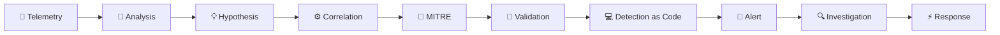

<!-- ========================================================= -->
<!--                         HERO                              -->
<!-- ========================================================= -->

 

 

<!-- ========================================================= -->
<!--                       TERMINAL                             -->
<!-- ========================================================= -->

<table>
<tr>
<td>

<pre>
╭──────────────────────────────────────────────────────────────╮
│  🔴  🟡  🟢               SECURITY SHELL                    │
├──────────────────────────────────────────────────────────────┤
│                                                              │
│  ❯ whoami                                                    │
│                                                              │
│  User       victor.mercury                                   │
│  Role       Cybersecurity Analyst                            │
│  Focus      Detection Engineering • Threat Hunting • SOAR    │
│  SIEM       Elastic Security • Microsoft Sentinel            │
│  Academic   Software Engineering                             │
│  Status     SYSTEM ONLINE                                    │
│  Location   Undisclosed                                      │
│                                                              │
│  ❯ _                                                         │
╰──────────────────────────────────────────────────────────────╯
</pre>

</td>
</tr>
</table>

### `Telemetry → Behavior → Signal → Investigation → Response`

  

<!-- ========================================================= -->
<!--                     CORE FOCUS                            -->
<!-- ========================================================= -->

<h2 align="center">🎯 Core Security Focus</h2>

 

 

  Engineering high-signal detections from telemetry, threat behavior and contextual correlation.
   
  Focused on scalable Security Operations, Threat Hunting and automated response.

  

<!-- ========================================================= -->
<!--                     CERTIFICATIONS                        -->
<!-- ========================================================= -->

<h2 align="center">🏅 Microsoft Security</h2>

  

<!-- ========================================================= -->
<!--                       STACK                               -->
<!-- ========================================================= -->

<h2 align="center">🌌 Security Engineering Stack</h2>

### `Detection • SIEM • Telemetry`

  

### `Network • Endpoint • Observability`

  

### `Engineering • Cloud • Automation`

  

<!-- ========================================================= -->
<!--                      PROJECTS                              -->
<!-- ========================================================= -->

<h2 align="center">⚡ Engineered Solutions</h2>

<table>
<tr>

<td width="50%" valign="top">

### 🏹 [Artemis SOAR](https://github.com/kaxcav0trace/artemis-project)

 

> **Security orchestration platform** for alert enrichment, threat intelligence caching and automated response workflows with FortiGate.

 

`SOAR` • `Threat Intel` • `Automation`

</td>

<td width="50%" valign="top">

### ⚡ [Sentinel Automation](https://github.com/kaxcav0trace/secops-automation-suite-v2)

 

> **Security Operations lab** using Microsoft Sentinel, KQL, APIs and automation workflows for investigation and Threat Hunting.

 

`SIEM` • `KQL` • `Threat Hunting`

</td>

</tr>

<tr>

<td width="50%" valign="top">

### 👁️ [SecOps Observability](https://github.com/kaxcav0trace/k8s-wazuh-lab)

 

> Kubernetes-based lab centralizing **security and infrastructure telemetry** across Wazuh, Zabbix and Grafana.

 

`K8s` • `Telemetry` • `Observability`

</td>

<td width="50%" valign="top">

### 🎯 Detection Engineering Lab

 

> Research lab focused on **telemetry analysis, detection hypotheses, correlation, ES|QL, KQL and MITRE ATT&CK mapping**.

 

`Detection as Code` • `MITRE` • `SIEM`

</td>

</tr>
</table>

  

<!-- ========================================================= -->
<!--                  DETECTION PIPELINE                       -->
<!-- ========================================================= -->

<h2 align="center">🔬 Detection Engineering Lifecycle</h2>

  

<!-- ========================================================= -->
<!--                     GITHUB STATS                          -->
<!-- ========================================================= -->

<h2 align="center">🔮 GitHub Intelligence</h2>

<table>
<tr>

<td>

</td>

<td>

</td>

</tr>
</table>

 

  

<!-- ========================================================= -->
<!--                       SNAKE                               -->
<!-- ========================================================= -->

### `CONTRIBUTION TELEMETRY`

 

 

<!-- ========================================================= -->
<!--                        FOOTER                             -->
<!-- ========================================================= -->

